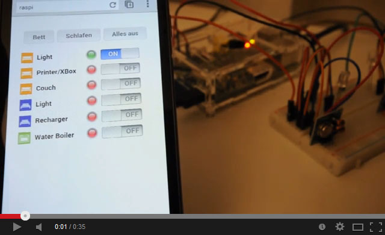

# ALX RCSwitch PI UI

Control your RC switches from your Smartphone or any browser via a nice UI.

sdfsdf
## Folder Structure

  **www**
  
  Content to be copied to the web server www root folder

  **images**

  Original Photoshop files and full resolution images for further adjustments

## Installation on Raspian

If you want to update or even upgrade installed packages use

`sudo apt-get update`

`sudo apt-get upgrade`

if Git is not yet installed it to be able to fetch the required sources

`sudo apt-get install git-core`

### Wiring Pi

Go to your home folder (or any other folder where you want to install)

`cd ~`

Download the WiringPi sources

`git clone git://git.drogon.net/wiringPi`

Build WiringPi

`cd wiringPi`

`./build`

### RCSwitch Pi

Go to your home folder

`cd ~`

Download the RCSwitch Pi sources

`git clone https://github.com/r10r/rcswitch-pi`

(If you use other switches than DIP switches (e.g. [Intertechno](http://code.google.com/p/rc-switch/wiki/HowTo_OperateLowCostOutlets)) you might also clone [my fork](https://github.com/alexanderlink/rcswitch-pi.git) containing required changes. [Pull Request](https://github.com/r10r/rcswitch-pi/pull/7) is pending...)

Build RCSwitch Pi

`cd rcswitch-pi`

`make`

### Lighttpd (Web Server)
Detailed information can be found [here](http://www.raspberrypi-spy.co.uk/2013/06/how-to-setup-a-web-server-on-your-raspberry-pi).

Install Lighttpd

`sudo apt-get -y install lighttpd`

Install PHP

`sudo apt-get -y install php5-common php5-cgi php5`

`sudo lighty-enable-mod fastcgi-php`

You can restart the Lighttpd service via

`sudo service lighttpd force-reload`

Adjust groups and permissions

`sudo chown www-data:www-data /var/www`

`sudo chmod 775 /var/www`

`sudo usermod -a -G www-data pi`

Reboot your Raspberry Pi

`sudo reboot`

### ALX RCSwitch Pi UI

Go to your home folder

`cd ~`

Download the ALX RCSwitch Pi UI sources

`git clone https://github.com/alexanderlink/alx-rcswitch-pi-ui.git`

Copy PHP scripts to www root

`cd alx-rcswitch-pi-ui/www`

`cp -rf * /var/www`

Download required additional files

`cd /var/www`

`chmod +x *.sh`

`./downloadDependencies.sh`

Since the rcswitch "send" command requires sudo permissions we have to adjust the sudoers file to enable using "send" from PHP.

`sudo visudo`

Append the following (adjust path if different)

`www-data ALL= NOPASSWD: /home/pi/rcswitch-pi/send`

`http://<raspberry-IP>` or `http://localhost` on the Raspi directly should now show the new Application.

If you already have a 433MHz sender module and a control LED (which shows the signal) connected to your Raspi the LED will blink already when you use the switches in the UI.

### Configuration

Adjust the /var/www/config.php.inc and configure the codes of your switches.
	
	
## Dependencies / Required Components

### iphone-style-checkboxes

  https://github.com/tdreyno/iphone-style-checkboxes
  Copyright/License: Copyright © 2009 Thomas Reynolds <me@tdreyno.com>, released under the MIT license*

### rcswitch-pi
https://github.com/r10r/rcswitch-pi.git
Copyright/License: Copyright (c) 2011 Suat Özgür.  All right reserved. / LGPL-2.1

### wiringPi
git://git.drogon.net/wiringPi
License: LGPL-3.0
  
### 3rd party icons:

  LEDs (CC0 License*)
  http://www.clker.com/clipart-6519.html (yellow)
  http://www.clker.com/clipart-6518.html (red)
  http://www.clker.com/clipart-6514.html (green)
  
## Licences:

License:: Copyright (c) 2014 Alexander Link, released under the MIT license

### Licenses Of Required Components

  Creative Commons Zero License (CC0)
  http://creativecommons.org/publicdomain/zero/1.0/
  
  MIT License
  http://opensource.org/licenses/MIT

  LGPL-2.1
  http://opensource.org/licenses/LGPL-2.1
  
  LGPL-3.0
  http://opensource.org/licenses/LGPL-3.0
